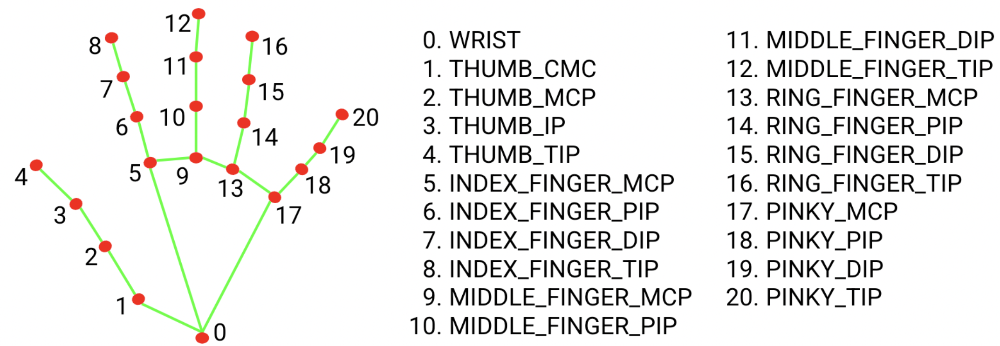

本工作主要讨论内容如下：

1. 在frmae上绘制交互内容，改动如下
    1. initial函数中，在cap中，frame放入显示队列的过程移动到interact函数中
    2. queue_keypoints添加image_show，进入intel进行绘制

```
image_show = cv2.flip(image_show, 1)
try:
    queue_frame_image.put_nowait(image_show)
except queue.Full:
    continue  # 直接继续，不记录日志以减少影响
    
queue_keypoints.put_nowait((keypoints, boxes, x_coordinates, y_coordinates))
变为
queue_keypoints.put_nowait((keypoints, boxes, x_coordinates, y_coordinates,image_show))
```

本工作主要讨论内容如下：

2. initial函数中，在cap中，frame放入显示队列的过程移动到interact函数中

# 已解决

1. 两种手部绘制速度对比

对比发现mp也是使用cv2作为绘图内容，本函数绘制的点更少，计算效率更高

```      
cv2.circle(image, landmark_px, circle_border_radius, WHITE_COLOR,drawing_spec.thickness)
# Fill color into the circle
cv2.circle(image, landmark_px, drawing_spec.circle_radius,drawing_spec.color, drawing_spec.thickness)
```

2. 左右手判断
   

手动改的版本1，还有很多条件没有判断清楚，冗余的地方很多，然后缺少比如检测到手腕，没有检测到手，或者检测到手，没有检测到手腕的判断，请你帮我修改

```commandline
def process_hand(image, mp_hands, data_cons, keypoints):
    image_hand = cv2.cvtColor(
        image[:, data_cons.WIDTH_DET_POSE - data_cons.WIDTH_DET_HAND:data_cons.WIDTH_DET_POSE + data_cons.WIDTH_DET_HAND, :3],
        cv2.COLOR_BGR2RGB)
    height, width, _ = image_hand.shape
    results_hand = mp_hands.process(image_hand).multi_hand_landmarks

    # 提取左右手手腕坐标
    lx, ly, rx, ry = None, None, None, None
    # 前三个左，后三个右
    hands_coordinates = [[None, None], [None, None], [None, None], [None, None], [None, None]]

    if len(keypoints) > 9:  # "left_wrist"
        lx, ly, _ = keypoints[9]
    if len(keypoints) > 10:  # "right_wrist"
        rx, ry, _ = keypoints[10]
    # TODO:程序没有考虑，比如手腕没有，但是手有，或者手有，手腕没有的情况
    # 提取左右手坐标]
    # 如果没有检测到手
    if not results_hand:
        return [], []
    # 一只手
    elif len(results_hand) == 1:
        hand_landmarks = results_hand[0].landmark
        x0, x8, x20 = hand_landmarks[0].x, hand_landmarks[8].x, hand_landmarks[20].x
        y0, y8, y20 = hand_landmarks[0].y, hand_landmarks[8].y, hand_landmarks[20].y
        # 去除归一化
        x0, x8, x20 = (x0 * width + data_cons.WIDTH_DET_POSE - data_cons.WIDTH_DET_HAND,
                       x8 * width + data_cons.WIDTH_DET_POSE - data_cons.WIDTH_DET_HAND,
                       x20 * width + data_cons.WIDTH_DET_POSE - data_cons.WIDTH_DET_HAND)
        y0, y8, y20 = y0 * height, y8 * height, y20 * height

        # 计算x0,y0与wx1,wy1的距离, x0,y0与wx2,wy2的距离
        dis_l = (x0 - lx) ** 2 + (y0 - ly) ** 2
        dis_r = (x0 - rx) ** 2 + (y0 - ry) ** 2

        # 如果dis_l < dis_r, 则为左手
        if dis_l < dis_r:
            hands_coordinates[0] = [x0, y0]
            hands_coordinates[1] = [x8, y8]
            hands_coordinates[2] = [x20, y20]
        # 否则为右手
        else:
            hands_coordinates[3] = [x0, y0]
            hands_coordinates[4] = [x8, y8]
            hands_coordinates[5] = [x20, y20]

    # 两只手
    else:
        hand_landmarks_l = results_hand[0].landmark
        hand_landmarks_r = results_hand[1].landmark

        x0_l, x8_l, x20_l = hand_landmarks_l[0].x, hand_landmarks_l[8].x, hand_landmarks_l[20].x
        y0_l, y8_l, y20_l = hand_landmarks_l[0].y, hand_landmarks_l[8].y, hand_landmarks_l[20].y

        x0_r, x8_r, x20_r = hand_landmarks_r[0].x, hand_landmarks_r[8].x, hand_landmarks_r[20].x
        y0_r, y8_r, y20_r = hand_landmarks_r[0].y, hand_landmarks_r[8].y, hand_landmarks_r[20].y

        # 归一化
        x0_l, x8_l, x20_l = (x0_l * width + data_cons.WIDTH_DET_POSE - data_cons.WIDTH_DET_HAND,
                             x8_l * width + data_cons.WIDTH_DET_POSE - data_cons.WIDTH_DET_HAND,
                             x20_l * width + data_cons.WIDTH_DET_POSE - data_cons.WIDTH_DET_HAND)
        y0_l, y8_l, y20_l = y0_l * height, y8_l * height, y20_l * height
        x0_r, x8_r, x20_r = (x0_r * width + data_cons.WIDTH_DET_POSE - data_cons.WIDTH_DET_HAND,
                             x8_r * width + data_cons.WIDTH_DET_POSE - data_cons.WIDTH_DET_HAND,
                             x20_r * width + data_cons.WIDTH_DET_POSE - data_cons.WIDTH_DET_HAND)
        y0_r, y8_r, y20_r = y0_r * height, y8_r * height, y20_r * height

        # 计算x0,y0与wx1,wy1的距离, x0,y0与wx2,wy2的距离
        dis_l = (x0_l - lx) ** 2 + (y0_l - ly) ** 2
        dis_r = (x0_l - rx) ** 2 + (y0_l - ry) ** 2
        if dis_l < dis_r:
            hands_coordinates[0] = [x0_l, y0_l]
            hands_coordinates[1] = [x8_l, y8_l]
            hands_coordinates[2] = [x20_l, y20_l]
            hands_coordinates[3] = [x0_r, y0_r]
            hands_coordinates[4] = [x8_r, y8_r]
            hands_coordinates[5] = [x20_r, y20_r]
        else:
            hands_coordinates[0] = [x0_r, y0_r]
            hands_coordinates[1] = [x8_r, y8_r]
            hands_coordinates[2] = [x20_r, y20_r]
            hands_coordinates[3] = [x0_l, y0_l]
            hands_coordinates[4] = [x8_l, y8_l]
            hands_coordinates[5] = [x20_l, y20_l]

    return hands_coordinates
```

GPT修改结果

```commandline
def process_hand(image, mp_hands, data_cons, keypoints):
    image_hand = cv2.cvtColor(
        image[:, data_cons.WIDTH_DET_POSE - data_cons.WIDTH_DET_HAND:data_cons.WIDTH_DET_POSE + data_cons.WIDTH_DET_HAND, :3],
        cv2.COLOR_BGR2RGB)
    height, width, _ = image_hand.shape
    results_hand = mp_hands.process(image_hand).multi_hand_landmarks

    # 提取左右手手腕坐标
    lx, ly, rx, ry = None, None, None, None
    if len(keypoints) > 9:  # "left_wrist"
        lx, ly, _ = keypoints[9]
    if len(keypoints) > 10:  # "right_wrist"
        rx, ry, _ = keypoints[10]

    # 初始化手部坐标
    hands_coordinates = [[None, None], [None, None], [None, None], [None, None], [None, None], [None, None]]

    if not results_hand:
        return hands_coordinates

    for hand_landmarks in results_hand:
        x0, x8, x20 = hand_landmarks[0].x, hand_landmarks[8].x, hand_landmarks[20].x
        y0, y8, y20 = hand_landmarks[0].y, hand_landmarks[8].y, hand_landmarks[20].y

        # 去除归一化
        x0, x8, x20 = (x0 * width + data_cons.WIDTH_DET_POSE - data_cons.WIDTH_DET_HAND,
                       x8 * width + data_cons.WIDTH_DET_POSE - data_cons.WIDTH_DET_HAND,
                       x20 * width + data_cons.WIDTH_DET_POSE - data_cons.WIDTH_DET_HAND)
        y0, y8, y20 = y0 * height, y8 * height, y20 * height

        # 计算手腕与手的距离
        if lx is not None and ly is not None and rx is not None and ry is not None:
            dis_l = (x0 - lx) ** 2 + (y0 - ly) ** 2
            dis_r = (x0 - rx) ** 2 + (y0 - ry) ** 2

            # 如果dis_l < dis_r, 则为左手
            if dis_l < dis_r:
                hands_coordinates[0] = [x0, y0]
                hands_coordinates[1] = [x8, y8]
                hands_coordinates[2] = [x20, y20]
            # 否则为右手
            else:
                hands_coordinates[3] = [x0, y0]
                hands_coordinates[4] = [x8, y8]
                hands_coordinates[5] = [x20, y20]

        # 如果只有左手腕
        elif lx is not None and ly is not None:
            hands_coordinates[0] = [x0, y0]
            hands_coordinates[1] = [x8, y8]
            hands_coordinates[2] = [x20, y20]

        # 如果只有右手腕
        elif rx is not None and ry is not None:
            hands_coordinates[3] = [x0, y0]
            hands_coordinates[4] = [x8, y8]
            hands_coordinates[5] = [x20, y20]

        # 如果没有手腕信息，默认第一个检测到的为右手，第二个检测到的为左手（如果有）
        else:
            if hands_coordinates[3] == [None, None]:
                hands_coordinates[3] = [x0, y0]
                hands_coordinates[4] = [x8, y8]
                hands_coordinates[5] = [x20, y20]
            else:
                hands_coordinates[0] = [x0, y0]
                hands_coordinates[1] = [x8, y8]
                hands_coordinates[2] = [x20, y20]

    return hands_coordinates
```

# 待解决

3. 检测函数更新

# 240715项目目的
本项目主要更新func_ActionDetector项目中的函数，多数动作将手划入交互内容
